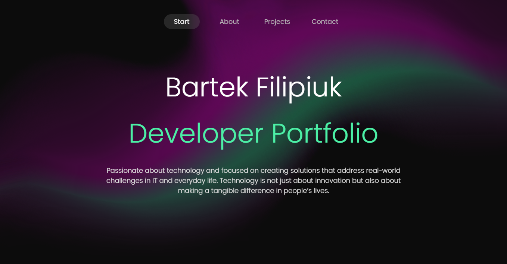

# My developer portfolio website

My personal portfolio website designed to showcase development skills and projects. This modern, responsive, and visually appealing site highlights creativity and technical expertise, serving as a central hub for potential clients, collaborators, and employers to explore work and learn more about me.

## Table of contents
1. [Where to visit?](#where-to-visit?)
4. [Features](#features)
5. [Technologies Used](#technologies-used)

## Where to visit?
My website is hosted via github pages, visit it via this link [Filipiuk.dev](https://bfilipiuk.github.io/Filipiuk-developer-portfolio-website/)

## Features
- **Responsive Design**: Ensures seamless display and functionality across devices, including desktops, tablets, and mobile phones.
- **Project Showcases**: Detailed sections highlighting key projects with descriptions, images, and links to live demos or source code.
- **Skills Overview**: Presents a structured overview of technical skills and proficiencies.
- **Contact Form**: Includes an interactive contact form for visitors to get in touch.
- **Optimized Performance**: Designed with modern best practices for fast load times and smooth user experience.

## Technologies used
- **HTML5 and CSS3**: For creating a structured and visually appealing layout.
- **JavaScript**: Enhances interactivity and dynamic elements.
- **React.js**: Powers the website with a component-based architecture for efficient rendering and maintainability.
- **EmailJS**: Enables the contact form to send emails directly without requiring a server or backend setup.
- **GitHub Pages**: Hosts the website, providing free and reliable deployment